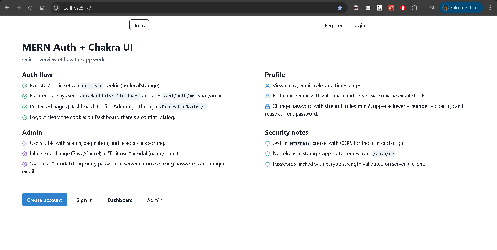
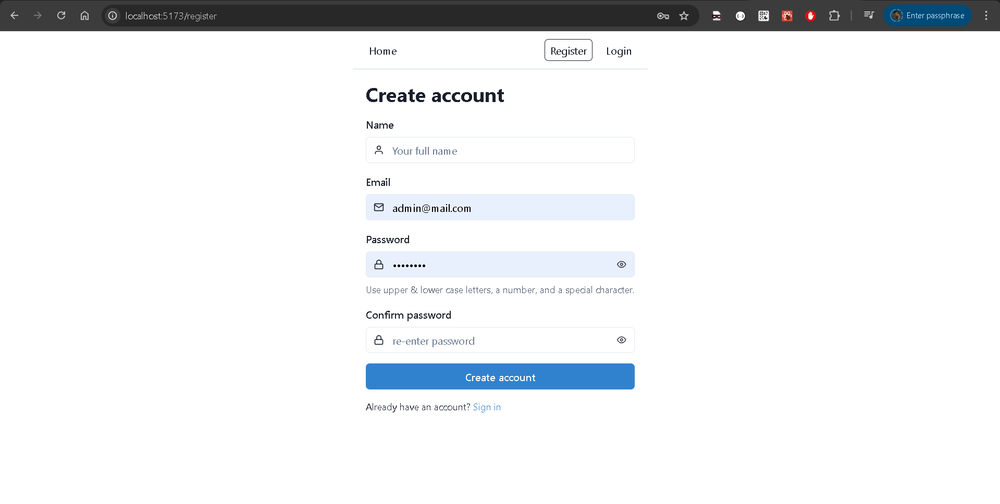
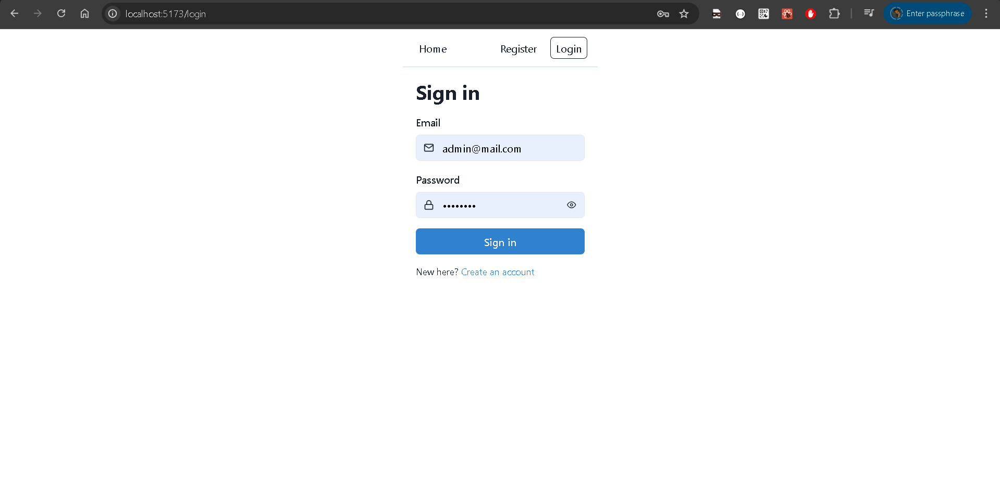
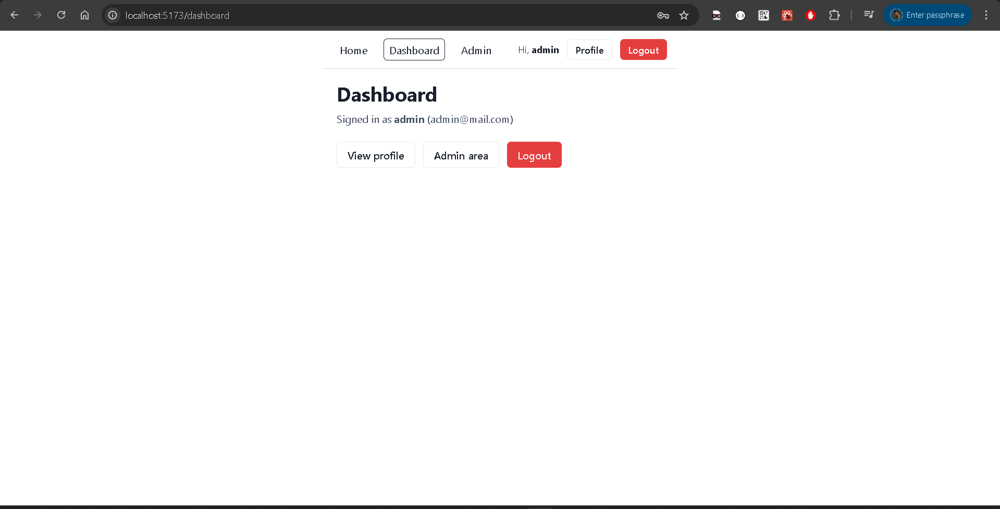
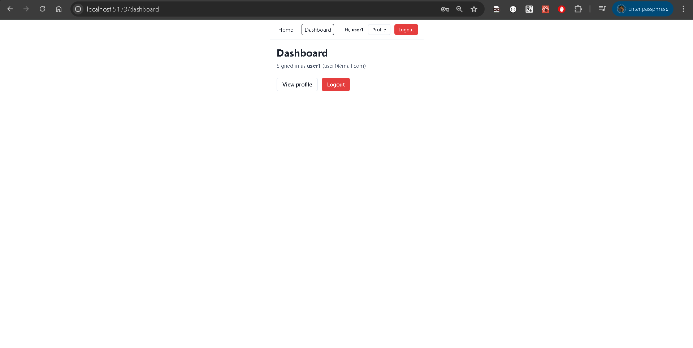
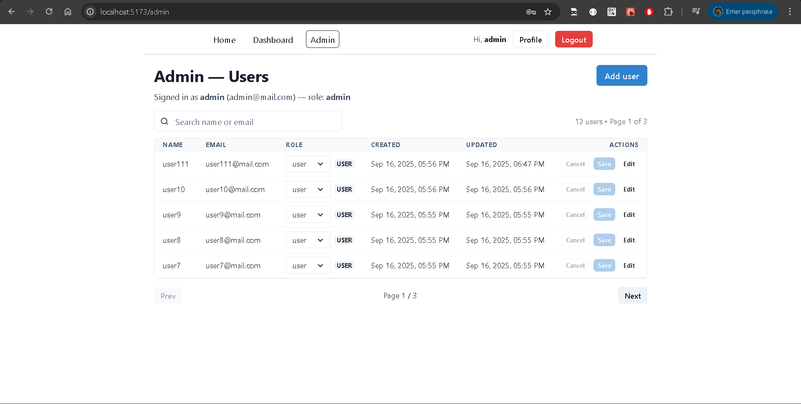
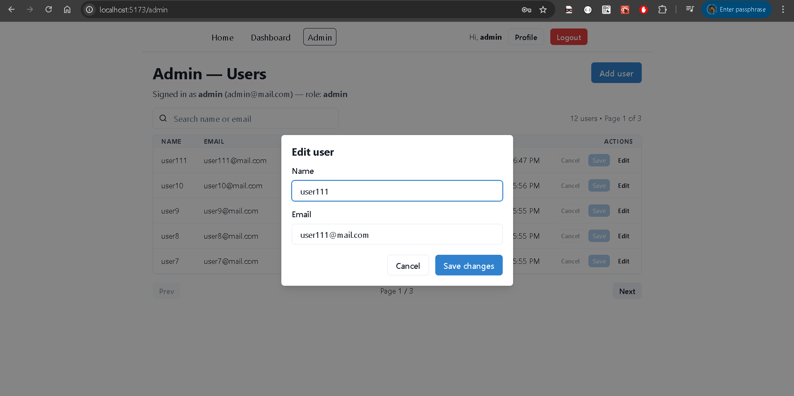
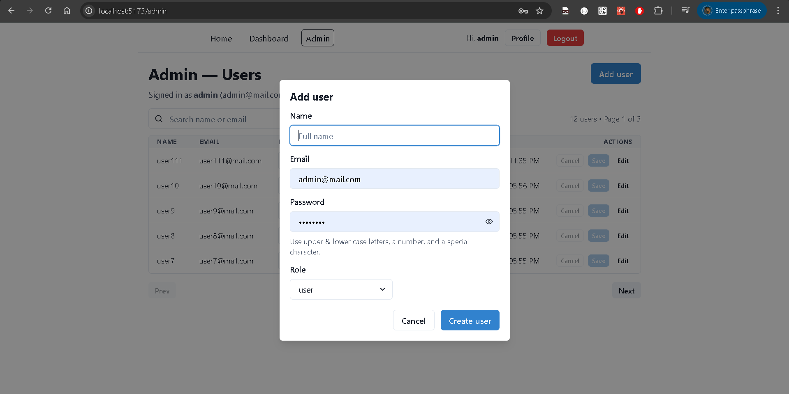
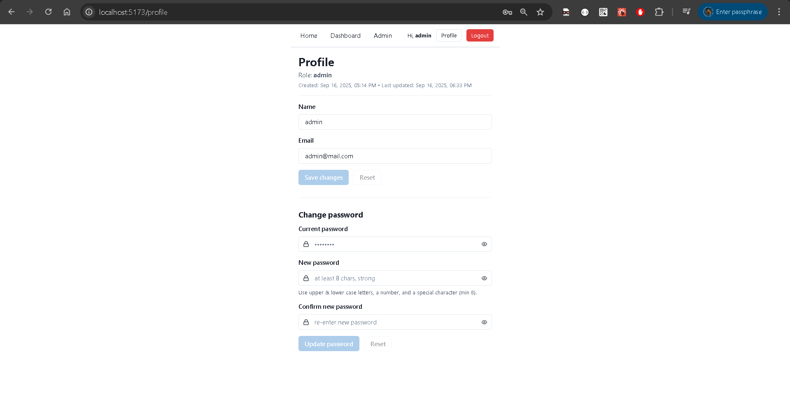
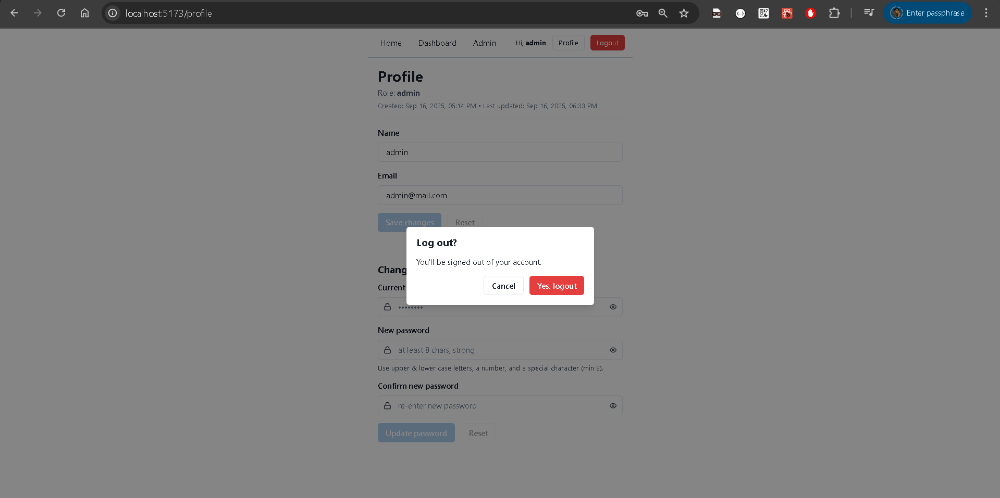

# mern-auth-chakra-frontend

React + Vite frontend for a cookie-based auth system.

-   UI: **Chakra UI**
-   Forms: **react-hook-form** + **Zod**
-   Router: **react-router-dom**
-   No localStorage/sessionStorage — server sets **HttpOnly** cookie

**Repos**

-   Backend → https://github.com/a2rp/mern-auth-chakra-backend
-   Frontend → https://github.com/a2rp/mern-auth-chakra-frontend _(this repo)_

---

## Quick start

```bash
# 1) Install deps
npm i

# 2) Configure API base URL
cp .env.example .env
# edit .env
# VITE_API_URL=http://localhost:1198

# 3) Run dev server
npm run dev
# http://localhost:5173
```

---

.env

```bash
# URL of the backend (no trailing slash)
VITE_API_URL=http://localhost:1198
```

Run the backend first: mern-auth-chakra-backend (link above).

---

## Features

-   Register / Login (server issues HttpOnly cookie)
-   Protected pages via <ProtectedRoute />
-   Dashboard with a logout confirm modal
-   Profile

    -   View name/email/role/timestamps
    -   Edit name & email (server validates unique email)
    -   Change password with strong rules (min 8, upper + lower + number + special; must differ from current)

-   Admin

    -   Users table with search, pagination, and click-to-sort headers
    -   Inline role change (Save/Cancel)
    -   Edit user modal (name + email)
    -   Add user modal (temporary password, strong rules)

-   Page wrappers capped at 1440px width
-   All requests include cookies: credentials: "include"

---

## Scripts

```bash
    "dependencies": {
        "@chakra-ui/react": "^2.4.9",
        "@emotion/react": "^11.14.0",
        "@emotion/styled": "^11.14.1",
        "@hookform/resolvers": "^5.2.2",
        "@mui/material": "^7.3.2",
        "framer-motion": "^12.23.13",
        "jsqr": "^1.4.0",
        "qrcode": "^1.5.4",
        "react": "^18.2.0",
        "react-dom": "^18.2.0",
        "react-hook-form": "^7.62.0",
        "react-icons": "^5.5.0",
        "react-router-dom": "^6.30.1",
        "styled-components": "^6.1.19",
        "zod": "^4.1.8"
    },
```

---

## How it talks to the backend

-   Base URL comes from VITE_API_URL
-   All requests go through src/lib/api.js
-   Always sends cookies:

```bash
await fetch(`${VITE_API_URL}/api/...`, {
    method: "POST",
    credentials: "include",
    headers: { "Content-Type": "application/json" },
    body: JSON.stringify(payload),
});
```

---

## Routes

-   / — Home
-   /register — Create account
-   /login — Sign in
-   /dashboard — Protected
-   /profile — Protected
-   /admin — Protected + role=admin

## Tech

React 18 • Vite • Chakra UI • react-hook-form • Zod • react-router-dom • styled-components • react-icons

## /



## /register



## /login



## /dashboard




## /admin





## /profile



