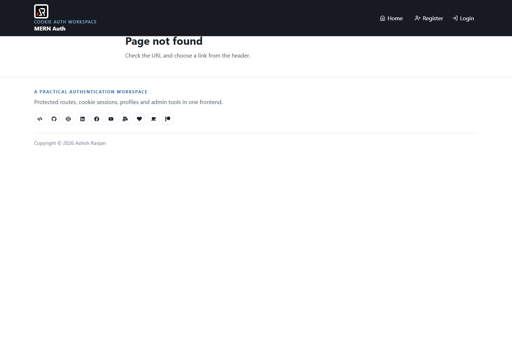

# MERN Auth Chakra Frontend

A React and Vite frontend for cookie-based authentication with protected routes, profile management, admin tools, and a responsive Chakra UI interface. Sessions stay in secure server cookies and the existing API contract is preserved.



## Features

- Fixed branded header with responsive mobile menu
- Register, login, dashboard, profile, admin, and protected routes
- HttpOnly cookie session flow with API requests using credentials
- Admin user search, pagination, sorting, role updates, and modals
- Chakra UI components, React Icons, accessible controls, and icon-only footer links
- Simple border, text-shadow, and box-shadow hover feedback

## Tech stack

React, Vite, Chakra UI, React Router, React Hook Form, Zod, Styled Components, React Icons, and Fetch API.

## Run locally

```bash
npm install
npm run dev
```

Set `VITE_API_URL` to the running backend URL, for example `http://localhost:1198`, then start the backend before using protected features.

## Routes

- `/` - Auth flow overview
- `/register` - Create an account
- `/login` - Sign in
- `/dashboard` - Protected dashboard
- `/profile` - Protected profile
- `/admin` - Admin-only user management

Future scope includes richer empty states, more account preferences, and additional admin reporting while keeping the current cookie session design.

## Links

- Portfolio: [https://www.ashishranjan.net](https://www.ashishranjan.net)
- GitHub: [https://github.com/a2rp](https://github.com/a2rp)
- CodePen: [https://codepen.io/ash1198](https://codepen.io/ash1198)
- LinkedIn: [https://www.linkedin.com/in/aashishranjan](https://www.linkedin.com/in/aashishranjan)
- Facebook: [https://www.facebook.com/theash.ashish/](https://www.facebook.com/theash.ashish/)
- YouTube: [https://www.youtube.com/@ashishranjan-ashz?sub_confirmation=1](https://www.youtube.com/@ashishranjan-ashz?sub_confirmation=1)
- Email: [ash.ranjan09@gmail.com](mailto:ash.ranjan09@gmail.com)

## Support

- Support: [https://a2rp-donation-page.netlify.app/](https://a2rp-donation-page.netlify.app/)
- Buy Me a Coffee: [https://buymeacoffee.com/a2rp](https://buymeacoffee.com/a2rp)
- Patreon: [https://patreon.com/a2rp](https://patreon.com/a2rp)